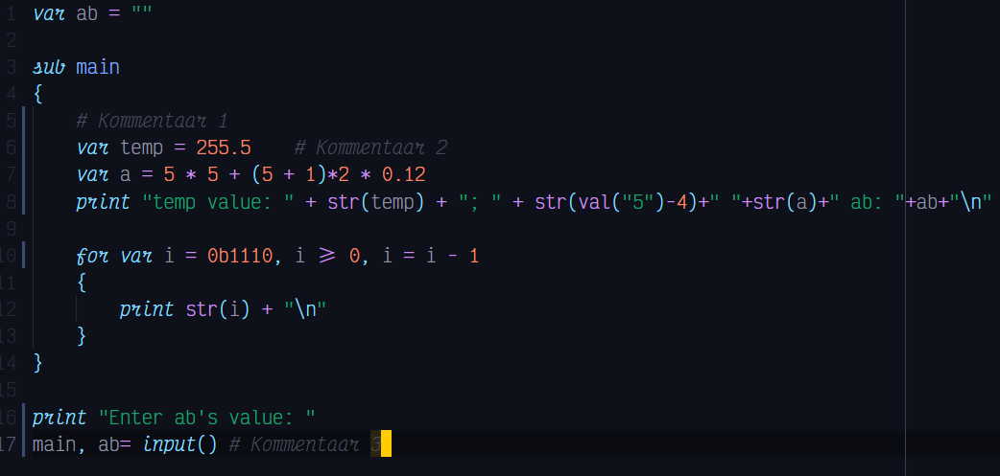

# h2o-squared

> A syntax highlighter for VS Code for the programming language [H2O^2](https://github.com/makuke1234/H2O2).

## Release Notes
### 1.0.0

Initial release, example of syntax highlighting:

**Enjoy!**
